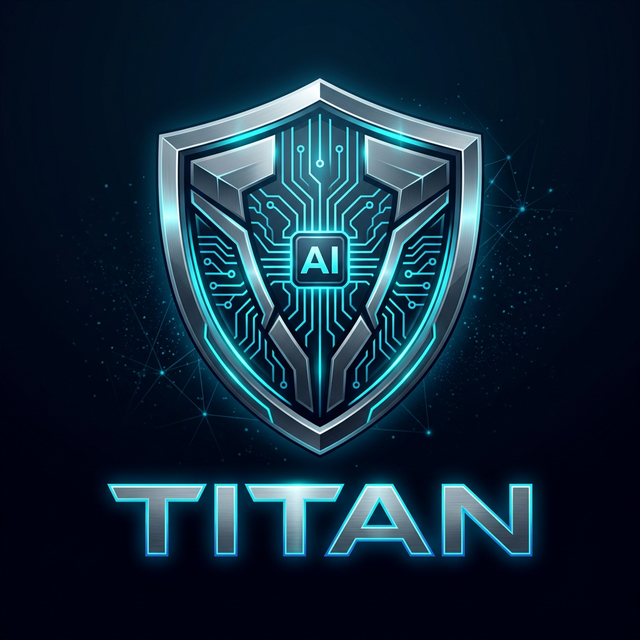

# ⚡ TITAN — The Intelligent Task Automation Network

<p align="center">
  
</p>

<p align="center">
  <strong>Your own personal AI agent. Any OS. Any platform. Superior by design.</strong>
</p>

<p align="center">
  <a href="#quick-start">Quick Start</a> •
  <a href="#why-titan">Why TITAN?</a> •
  <a href="#features">Features</a> •
  <a href="#mission-control">Mission Control</a> •
  <a href="#comparison">Comparison</a> •
  <a href="#roadmap">Roadmap</a>
</p>

---

## Quick Start

**Requirements:** Node.js ≥ 20, npm ≥ 9

```bash
npm install -g titan-agent
titan onboard          # Interactive setup wizard (choose your AI provider + API key)
titan gateway          # Start Mission Control at http://localhost:48420
titan agent -m "Hello" # Send a direct message
```

### Run from Source (for developers)
```bash
git clone https://github.com/Djtony707/TITAN.git
cd TITAN/titan
npm install
cp .env.example .env   # Add your API keys
npm run onboard
npm run gateway
```


## Why TITAN?

TITAN was built to solve the real problems with every other AI agent framework in 2026:

| The Problem | Who Has It | TITAN's Solution |
|------------|-----------|-----------------|
| **Infinite loop hell** | OpenClaw, NanoClaw, PicoClaw | **Loop Detection + Circuit Breaker** — 3 detectors (repeat, no-progress, ping-pong) with configurable thresholds |
| **Token waste & high cost** | OpenClaw (430K LoC, 1GB+ RAM) | **Smart Context Manager** — auto-summarizes old history, priority-based allocation, token budget tracking |
| **Goal drift / runaway agents** | Most agent frameworks | **Task Planner** — dependency graphs, 3x retry, parallel task execution with progress tracking |
| **No learning from mistakes** | All alternatives | **Continuous Learning Engine** — tracks tool success rates, error patterns, and injects knowledge into every prompt |
| **Basic dashboards** | OpenClaw, NanoClaw, IronClaw | **Mission Control GUI** — premium 11-panel dark-mode dashboard with WebSocket real-time updates |
| **Native dependencies / complex setup** | OpenClaw (native deps), IronClaw (Rust), ZeroClaw (Rust), PicoClaw (Go) | **Pure TypeScript** — `npm install` just works, no compilation required |

---

## Features

### 🛡️ Prompt Injection Shield & RBAC (TITAN-exclusive)
Zero tolerance for unauthorized takeovers:
- **Heuristic Engine** — Detects and blocks "ignore previous instructions", "developer mode", and system prompt extraction logic.
- **Strict Mode** — Scans for keyword density and tail manipulations in massive payloads.
- **Role-Based Access Control (RBAC)** — Unverified / guest users are structurally blocked from executing dangerous tools, even if TITAN is in full autonomous mode.

### 🛡️ Loop Detection & Circuit Breaker (TITAN-exclusive)
No more infinite tool loops. Three detection algorithms:
- **Generic Repeat** — same tool + same args called repeatedly
- **No-Progress Polling** — tool returns identical output each time
- **Ping-Pong** — alternating A↔B patterns with no progress
- **Global Circuit Breaker** — hard stop after configurable threshold

### 📋 Task Planner with Dependency Graphs (TITAN-exclusive)
- Automatic goal decomposition into sub-tasks
- Dependency tracking — tasks only execute when prerequisites are met
- 3x auto-retry on failure with exponential backoff
- Parallel execution of independent tasks
- Persistent plan tracking (`~/.titan/plans/`)

### 🧠 Smart Context Manager (TITAN-exclusive)
- Auto-summarizes old conversation history to save tokens
- Priority-based context allocation (recent > relevant > old)
- Token budget tracking with per-model limits
- Smart truncation that preserves tool call context

### 🧠 Continuous Learning Engine
- Tracks tool success/failure rates across all interactions
- Records error patterns and resolutions
- Builds persistent knowledge base (`~/.titan/knowledge.json`)
- Injects learned context into every system prompt
- **TITAN actually gets smarter the more you use it**

### 🤖 Multi-Agent System (up to 5 concurrent)
- Independent agent instances with different models/prompts
- Channel-based routing — each agent binds to specific channels
- Manage via CLI (`titan agents`) or Mission Control GUI

### 🔧 17+ Built-in Tools
| Group | Tools |
|-------|-------|
| **Runtime** | `exec` (background/timeout), `process` (list/poll/kill/log), `shell` |
| **Filesystem** | `read`, `write`, `edit`, `list_dir`, `apply_patch` |
| **Web** | `web_search`, `web_fetch`, `browser` (CDP) |
| **Intelligence** | `auto_generate_skill`, `analyze_image` (Vision), `transcribe_audio` (STT), `generate_speech` (TTS) |
| **Automation** | `cron`, `webhook` |
| **Memory** | `memory`, `learning` |
| **Sessions** | `sessions_list`, `sessions_history`, `sessions_send`, `sessions_close` |

### 🧬 Skill Auto-Generation & Plugin Marketplace
- **Self-Writing Code** — If TITAN lacks a tool for your request, it uses `auto_generate_skill` to write it in TypeScript, compile it, and hot-load it instantly.
- **Plugin Marketplace** — Browse and install community skills via `titan skills install <name>`.

### 👁️ Multimodal (Vision & Voice)
- **Vision** — TITAN can "see" images via Claude 3.5 Sonnet / GPT-4o using the `analyze_image` tool.
- **Voice** — TITAN handles Speech-to-Text (Whisper) and Text-to-Speech via the `transcribe_audio` and `generate_speech` tools.

### 📡 10+ Channel Adapters
Discord · Telegram · Slack · Google Chat · WebChat · WhatsApp · Matrix · Signal · MS Teams · BlueBubbles

### 🔐 Security
- **E2E Encrypted Sessions** — AES-256-GCM encryption for sensitive conversations (keys held securely in-memory).
- DM pairing (approve/deny new senders)
- Docker sandbox for non-main sessions
- Tool/path/network allowlisting

### 🤝 Model Agnostic
Anthropic (Claude) · OpenAI (GPT) · Google (Gemini) · Ollama (local) — with automatic failover

---

## Mission Control

TITAN ships with a premium **Mission Control** web GUI — a dark-mode dashboard served from the gateway at `http://localhost:48420`.

### 11 Panels:
| Panel | Description |
|-------|-------------|
| **📊 Overview** | System health, stats, uptime, memory, version |
| **💬 WebChat** | Built-in chat with real-time WebSocket |
| **🤖 Agents** | Spawn/stop agents, capacity monitor |
| **🧩 Skills** | Installed skills with version and status |
| **⚙️ Processes** | Background process management |
| **📋 Plans** | Task planner visualization and progress |
| **🔗 Sessions** | Active session list with message counts |
| **📡 Channels** | Channel adapter connection status |
| **🔒 Security** | Security audit and pairing management |
| **🧠 Learning** | Learning engine stats and tool success rates |
| **📜 Logs** | Real-time system log viewer |

---

## Comparison

### TITAN vs. 2026 OpenClaw Ecosystem

| Feature | **TITAN** | OpenClaw | NanoClaw | IronClaw | PicoClaw | ZeroClaw | TrustClaw | Nanobot |
|---------|-----------|----------|----------|----------|----------|----------|-----------|---------|
| **Language** | TypeScript | TypeScript | TypeScript | Rust | Go | Rust | Cloud | Python |
| **Codebase** | ~7K LoC | ~430K LoC | ~500 LoC | Medium | Small | Small | Managed | ~4K LoC |
| **Native deps** | ❌ None | ✅ Required | ❌ | ✅ (Rust) | ✅ (Go) | ✅ (Rust) | N/A | ❌ |
| **Loop detection** | ✅ 3 detectors + circuit breaker | ❌ | ❌ | ❌ | ❌ | ❌ | ❌ | ❌ |
| **Task planner** | ✅ Dependency graphs | ❌ | ❌ | ❌ | ❌ | ❌ | ❌ | ❌ |
| **Smart context** | ✅ Auto-summarize + budget | ❌ | ❌ | ❌ | ❌ | ❌ | ❌ | ❌ |
| **Continuous learning** | ✅ Built-in | ❌ | ❌ | ❌ | ❌ | ❌ | ❌ | ❌ |
| **Multi-agent** | ✅ Up to 5 | ✅ | ❌ | ❌ | ❌ | ❌ | ❌ | ❌ |
| **Mission Control GUI** | ✅ 11 panels, premium | ✅ Basic | ❌ | ❌ | ❌ | ❌ | ✅ | ❌ |
| **Browser control** | ✅ CDP | ✅ CDP | ❌ | ❌ | ❌ | ❌ | ✅ | ❌ |
| **Background processes** | ✅ exec+process | ✅ | ❌ | ✅ | ❌ | ✅ | ✅ | ✅ |
| **Apply patch** | ✅ Unified diffs | ✅ | ❌ | ❌ | ❌ | ❌ | ❌ | ❌ |
| **DM pairing** | ✅ | ✅ | ❌ | ❌ | ❌ | ❌ | ❌ | ❌ |
| **Docker sandbox** | ✅ | ✅ | ✅ | Wasm | ❌ | ✅ | ✅ Cloud | ❌ |
| **Channels** | 10+ | 12+ | WhatsApp | Limited | Limited | Multiple | Multiple | Multiple |
| **Memory** | ✅ Persistent + learning | ✅ | ✅ | ✅ | ❌ | ✅ | ✅ | ✅ |
| **Local models (Ollama)** | ✅ | ✅ | ✅ | ✅ | ✅ | ✅ | ❌ | ✅ |
| **RAM usage** | ~50MB | ~1GB+ | ~30MB | ~20MB | <10MB | <5MB | Cloud | ~40MB |
| **Setup complexity** | `npm install` | Complex | Docker | Compile | Single binary | Compile | OAuth | `pip install` |

### What Makes TITAN Different

**vs. OpenClaw** — OpenClaw is powerful but bloated (430K lines, 1GB+ RAM, native deps). TITAN delivers the same capabilities in ~5K lines of pure TypeScript with zero native dependencies, plus exclusive features: loop detection, task planner, smart context management, and continuous learning.

**vs. NanoClaw** — NanoClaw prioritizes minimal code (~500 lines) over features. It lacks browser control, multi-agent, background processes, and a dashboard. TITAN offers full-featured operation with a manageable codebase.

**vs. IronClaw** — IronClaw's Rust + Wasm approach is great for security but requires compilation and has limited channel support. TITAN provides comparable security via Docker sandbox with zero compilation required.

**vs. PicoClaw** — PicoClaw targets embedded/resource-constrained environments (<10MB RAM). TITAN targets users who want a full-featured agent that still doesn't bloat to 1GB like OpenClaw.

**vs. ZeroClaw** — ZeroClaw's Rust implementation is fast but requires compilation and has a steeper learning curve. TITAN offers comparable performance with TypeScript's developer-friendliness.

**vs. TrustClaw** — TrustClaw is cloud-managed (no self-hosting). TITAN gives you full control on your own hardware with local model support.

**vs. Nanobot** — Nanobot is Python-based with good transparency, but lacks browser control, multi-agent, task planning, and a GUI. TITAN covers all bases.

---

## Roadmap

### ✅ v2026.2.26 — Foundation Release
- [x] Multi-agent system (up to 5)
- [x] 17+ built-in tools (shell, filesystem, browser, process, web, cron, webhooks, sessions, memory, patch)
- [x] Continuous learning engine
- [x] Loop detection & circuit breaker
- [x] Task planner with dependency graphs
- [x] Smart context manager
- [x] Mission Control GUI (11 panels)
- [x] 10+ channel adapters
- [x] 4 LLM providers with failover
- [x] DM pairing security
- [x] Docker support

### ✅ v2026.4 — Intelligence Update
- [x] **Skill auto-generation** — TITAN writes its own new skills when it encounters tasks it can't solve
- [x] **Image analysis tool** — Vision capabilities for screenshots, diagrams, photos
- [x] **Voice channel support** — Discord/Telegram voice with speech-to-text and text-to-speech
- [x] **Plugin marketplace** — Community-contributed skills with one-click install
- [x] **E2E encrypted sessions** — End-to-end encryption for sensitive conversations

### ✅ v2026.4.9 — Stability & Bug-Fix Release (Current)
- [x] **19 crash/runtime/silent-failure fixes** across 15 source files — full end-to-end audit
- [x] **6 critical crash fixes** — unguarded `writeFileSync` calls, unhandled async rejections in `stallDetector`, `costOptimizer` undefined fallback, `Math.max` on empty array
- [x] **12 high-priority runtime fixes** — `executeTools` error handling, Google provider tool role mapping, `monitor.ts` fire-and-forget async, Discord null guard, `doctor.ts` `parseInt` on undefined, top-level IIFE unhandled rejection, shell injection in `web_fetch` and `marketplace`
- [x] **4 medium fixes** — usage stats ID collision, `|| 0` vs `?? 0` timeout bugs in `shell` and `process`, `responseCache` missing Array guard

### 🔮 v2026.6 — Autonomy Update
- [ ] **Proactive agent mode** — TITAN monitors your system and takes action without being asked
- [ ] **Multi-model reasoning** — Chain multiple models for complex tasks (fast model for planning, powerful model for execution)
- [ ] **Git workflow integration** — PR reviews, automated commits, branch management
- [ ] **OAuth tool marketplace** — Connect to 500+ SaaS apps (Google, GitHub, Notion, Jira, etc.)
- [ ] **Mobile app** — iOS/Android companion app for on-the-go TITAN access

### 🚀 v2026.9 — Enterprise Update
- [ ] **Team mode** — Multiple users, role-based access, shared agents
- [ ] **Audit logging** — Full compliance audit trail
- [ ] **SSO integration** — SAML/OIDC authentication
- [ ] **Custom model fine-tuning** — Train models on your organization's data
- [ ] **On-premise deployment** — Kubernetes-ready with Helm charts

### 🌟 v2027+ — Next Generation
- [ ] **Agent-to-agent marketplace** — TITAN agents can discover and collaborate with other TITAN instances
- [ ] **Natural language programming** — Describe apps in plain English, TITAN builds them
- [ ] **Predictive task execution** — AI predicts what you need before you ask
- [ ] **Hardware integration** — IoT, smart home, robotics control

---

## 💡 Feature Requests

**Have an idea for TITAN?** We want to hear it!

Open an issue on GitHub or reach out directly:

👉 **[Open a Feature Request](https://github.com/Djtony707/TITAN/issues/new?labels=feature-request&template=feature_request.md&title=%5BFeature%5D+)**

👉 **Contact:** [Tony Elliott on GitHub](https://github.com/Djtony707)

Every feature request is reviewed. The best ideas make it into the roadmap. Let's build the future of AI agents together.

---

## CLI Reference

| Command | Description |
|---------|-------------|
| `titan onboard` | Interactive setup wizard |
| `titan gateway` | Start Mission Control (port 48420) |
| `titan agent -m "..."` | Direct message |
| `titan send --to ch:id -m "..."` | Send to channel |
| `titan pairing` | DM access control |
| `titan agents` | Multi-agent management |
| `titan doctor` | Diagnostics |
| `titan skills` | Skill management |
| `titan config` | Configuration |
| `titan update` | Update TITAN |

---

## Credits

**Project Creator / Owner:** [Tony Elliott](https://github.com/Djtony707)

### Acknowledgments

TITAN's architecture is inspired by patterns from the open-source AI agent community:

- **[OpenClaw](https://github.com/openclaw/openclaw)** — The original personal AI assistant framework. TITAN's gateway, skills system, session model, and security patterns are inspired by OpenClaw's design. MIT License.

Dependencies: Anthropic SDK, OpenAI SDK, Google Generative AI, discord.js, grammY, Bolt (Slack), Zod, Commander.js, Express, ws, chalk, uuid, Vitest.

---

## License

MIT License — Copyright (c) 2026 Tony Elliott. See [LICENSE](LICENSE).
